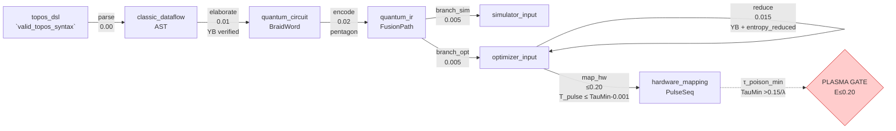
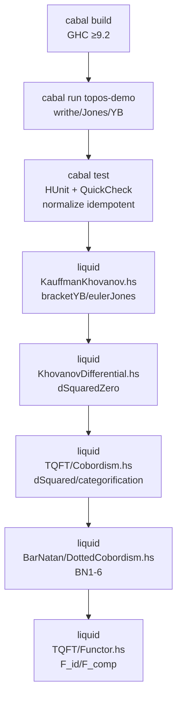
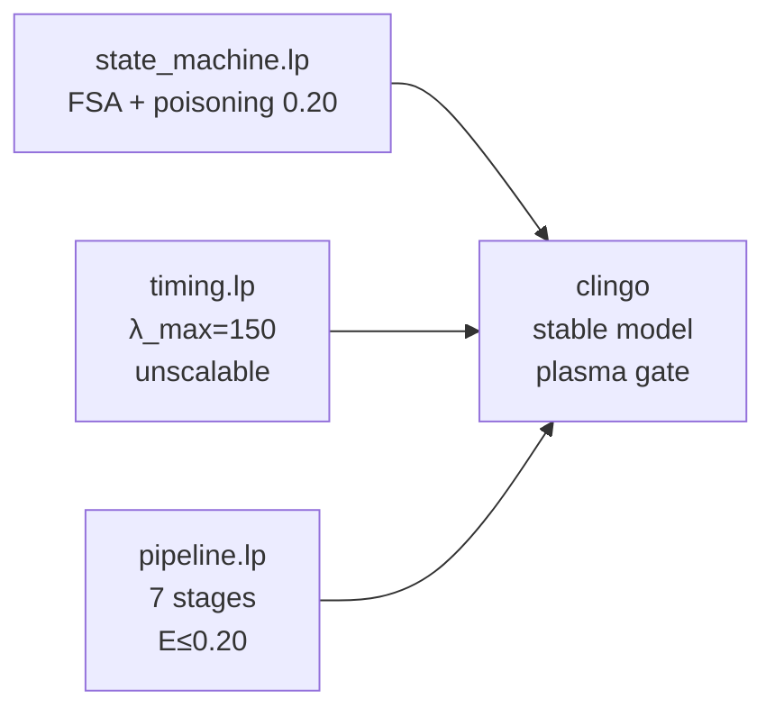
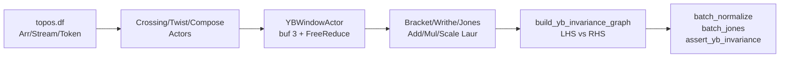

<!-- COMMENT SOVEREIGN LEVIATHAN COVENANT - FRAGMENT BINDING; -->
<!-- COMMENT Node-ID: TOPOS-FILE-014-README; -->
<!-- COMMENT Parent-Work: topos; -->
# Topos — 編織拓撲不變量領域特定語言

**主權邏輯逃脫：拓撲量子計算控制迴路形式化**  
**專案：** `ENKI_PHYSICS_TO_ALGEBRAIC_MAPPING` · **狀態：** 確定性狀態機建構中

> 本專案將 ENKI 的隨機量子物理層映射為**離散、確定性的代數域**——跳轉表有限狀態機（FSA）＋ 編織么半群（Braid Monoid）＋ 多項式不變量——使經典控制邏輯能針對「準粒子中毒」（quasiparticle poisoning）與退相干進行形式化驗證。

---

## 逃脫全景圖

```
隨機物理層  ──►  離散跳轉表  ──►  編織么半群＋不變量
(τ_poison ~ 1μs–1ms)   (FSA: ground ─► braiding ─► measurement ─► poisoned)
                                                    │
                                                    ▼
                     Topos.Core + Datalog（規格／參考）
                     NESL + Dataflow（平行化 YB / Jones）
                     Liquid Kauffman/Khovanov + 微分（已驗證）
                     TQFT 配邊（Cobordism）+ Bar-Natan + 函子 F:Cob→Vect （9 核心皆一致於 YB）
```

### 核心洞察

* **拓撲保護 ≠ 結構免疫**：拓撲僅降低中毒邊的*權重*，但跳轉表的*結構*仍脆弱——任何將系統踢出簡併基態流形的事件皆可觸發 `poisoned_collapse`。
* 工程化為競速：`T_reset < τ_poison` 且 `λ < 150 entropy/ms`，否則重置在熱力學上被禁止（見 `prolog/timing.lp`）。

### 快速開始（中文）

 * ===============================================================
 * SOVEREIGN LEVIATHAN COVENANT — FRAGMENT BINDING
 * ==============================================================
 * License-ID:        SL-AGPL3-001
 * Covenant-Version:  1.0
 * Node-ID:           TOPOS-FILE-014-README
 * Parent-Covenant:   SL-AGPL3-001
 * Copyright:         2026 SNAPKITTYWEST
 * Source-Hash:       sha256:ed702c48da6e06560447c4cea1de9f3ae055ab7dbc530df0ed9a6f18b20f7ef1
 *
 * This file is governed by the GNU Affero General Public License,
 * version 3, together with the applicable Sovereign Leviathan
 * additional terms identified by this notice.
 *
 * Hark, though this node be but a spark,
 * Its covenant endureth through the dark.
 *
 * Lex in solido: the applicable license governs the covered work
 * according to its actual terms and applicable law.
 *
 * Ignorantia juris non excusat.
 * ===============================================================


## 節點清單（Node Manifest）— 每個節點皆可追溯至 Covenant

| 節點 ID | 檔案 | 說明 | 授權 |
|---|---|---|---|
| `TOPOS-FILE-001-Core` | `src/Topos/Core.hs` | 編織代數、YB、Jones/Alexander/HOMFLY、Burau | SL-AGPL3-001 / MGPLv3 |
| `TOPOS-FILE-002-KauffmanKhovanov` | `src/Topos/KauffmanKhovanov.hs` | Kauffman括號狀態和、Jones、Khovanov同調、eulerJones | SL-AGPL3-001 / MGPLv3 |
| `TOPOS-FILE-003-KhovanovDifferential` | `src/Topos/KhovanovDifferential.hs` | Frobenius m/Δ、微分、d²=0 | SL-AGPL3-001 / MGPLv3 |
| `TOPOS-FILE-004-TQFT-Cobordism` | `src/Topos/TQFT/Cobordism.hs` | 雙層TQFT、配邊求值、範疇化 | SL-AGPL3-001 / MGPLv3 |
| `TOPOS-FILE-005-BarNatan-DottedCobordism` | `src/Topos/BarNatan/DottedCobordism.hs` | Bar-Natan 帶點配邊、BN1-6、雙範疇 | SL-AGPL3-001 / MGPLv3 |
| `TOPOS-FILE-006-TQFT-Functor` | `src/Topos/TQFT/Functor.hs` | 純函子 F:Cob→Vect、同調、長正合、譜序列 | SL-AGPL3-001 / MGPLv3 |
| `TOPOS-FILE-007-state-machine` | `prolog/state_machine.lp` | FSA跳轉表、中毒洩漏、等離子閘 | SL-AGPL3-001 / MGPLv3 |
| `TOPOS-FILE-008-timing` | `prolog/timing.lp` | 重置延遲界、λ_max=150、不可擴展性 | SL-AGPL3-001 / MGPLv3 |
| `TOPOS-FILE-009-braid-axioms` | `datalog/braid_axioms.dl` | 辮群B_n、Yang-Baxter飽和 | SL-AGPL3-001 / MGPLv3 |
| `TOPOS-FILE-010-NESL` | `nesl/topos.nesl` | NESL巢狀平行化 | SL-AGPL3-001 / MGPLv3 |
| `TOPOS-FILE-011-Dataflow` | `dataflow/topos.df` | Dataflow陣列平行化、Actor圖 | SL-AGPL3-001 / MGPLv3 |
| `TOPOS-FILE-014-README` | `README.md` | 雙語 README（本檔案）、節點連結 | SL-AGPL3-001 / MGPLv3 |
| `TOPOS-FILE-015-Cabal` | `topos.cabal` | 組建描述、6個暴露模組 | SL-AGPL3-001 / MGPLv3 |
| `TOPOS-FILE-016-Architecture` | `docs/architecture.md` | 架構、十重YB等價性 | SL-AGPL3-001 / MGPLv3 |
| `TOPOS-FILE-017-Pipeline` | `prolog/pipeline.lp` | 編譯管線確定性狀態轉換、熵限、τ中毒閘 | SL-AGPL3-001 / MGPLv3 |

詳見 [`docs/NODE_MANIFEST.json`](docs/NODE_MANIFEST.json) 與 [`docs/PROVENANCE.md`](docs/PROVENANCE.md)；授權見 [`LICENSE`](LICENSE)。

---

## English — Detailed Documentation

> 以下為英文完整技術文檔（Top of this README is Traditional Chinese; the rest is English as requested）


Maps ENKI's stochastic quantum physics layer to a **discrete, deterministic algebraic domain** — a jump-table FSA + braid algebra + polynomial invariants — so classical control logic can be formally verified against poisoning / decoherence.


## Quickstart — Flowcharts (not slop)

> **From this point down — flowcharts, not slop.** Each stage is a deterministic transition with plasma-gate entropy ≤0.20 and `τ_poison` gating — runnable via the commands embedded in the charts.

### 0. Overall — `prolog/pipeline.lp` (7 stages)



*Renders the ASP pipeline: `stage/1` + `transition/4` + `tau_poison_min/2` → hardware mapping is strictly `τ_poison`-gated.*

### 1. Haskell — `Topos.Core` + Liquid (`src/Topos/`)



```bash
cabal build
cabal run topos-demo
cabal test
liquid src/Topos/KauffmanKhovanov.hs       # bracketYB, jonesYB
liquid src/Topos/KhovanovDifferential.hs   # dSquaredZero
liquid src/Topos/TQFT/Cobordism.hs         # dSquared
liquid src/Topos/BarNatan/DottedCobordism.hs
liquid src/Topos/TQFT/Functor.hs
```

### 2. ASP — `prolog/*.lp` (clingo)



```bash
clingo prolog/state_machine.lp   # valid_transition / invalid_op
clingo prolog/timing.lp          # valid_reset_sequence / unscalable(150)
clingo prolog/pipeline.lp        # pipeline stage validation + #minimize
```


### 4. Dataflow — `dataflow/topos.df` (array/stream)



```bash
ts-node dataflow/topos.df  # build_yb_invariance_graph + assert_yb_invariance()
# → true  (sparse polys equal)

> `T_reset  <  τ_poison`  and  `λ < 150 entropy/ms` — otherwise reset is thermodynamically forbidden.

---

## License

**Sovereign Leviathan Covenant — SL-AGPL3-001 / MGPLv3** (AGPLv3 + Sovereign Leviathan additional terms, England & Wales) — see `LICENSE`.

Each file carries `/* SOVEREIGN LEVIATHAN COVENANT — FRAGMENT BINDING */` with `Node-ID`, `Source-Hash`, `License-ID: SL-AGPL3-001`, `Covenant-Version: 1.0` — see `docs/NODE_MANIFEST.json` and `docs/PROVENANCE.md`.

Governing law: England and Wales. English controlling; العربية and 中文 co-equal.

## Citation

```
Topos: Braided DSL for Topological Invariants — ENKI_PHYSICS_TO_ALGEBRAIC_MAPPING
Hilbert Parr, 2026. Sovereign Logic Escape: TQC Control Loop Formalization.
```
