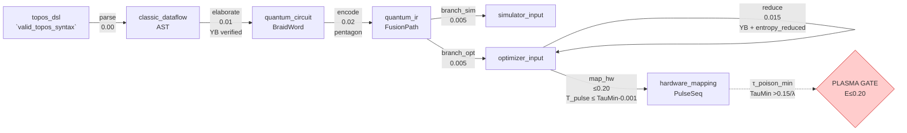
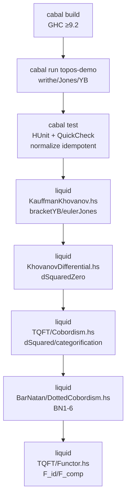
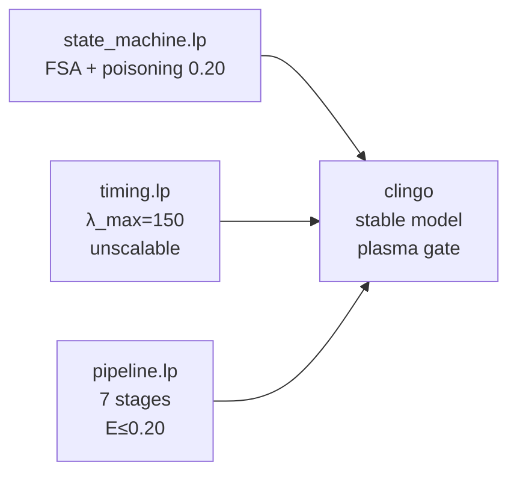
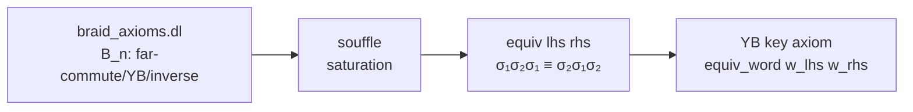
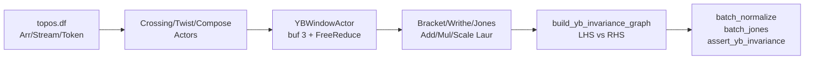

/* ========================================================================
 * SOVEREIGN LEVIATHAN COVENANT — FRAGMENT BINDING
 * ========================================================================
 *
 * License-ID:        SL-AGPL3-001
 * Covenant-Version:  1.0
 * Node-ID:           TOPOS-FILE-014-README
 * Parent-Covenant:   SL-AGPL3-001
 * Copyright:         2026 SNAPKITTYWEST
 * Source-Hash:       sha256:ed702c48da6e06560447c4cea1de9f3ae055ab7dbc530df0ed9a6f18b20f7ef1
 *
 * This file is governed by the GNU Affero General Public License,
 * version 3, together with the applicable Sovereign Leviathan
 * additional terms identified by this notice.
 *
 * Hark, though this node be but a spark,
 * Its covenant endureth through the dark.
 *
 * Lex in solido: the applicable license governs the covered work
 * according to its actual terms and applicable law.
 *
 * Ignorantia juris non excusat.
 *
 * ======================================================================== */

<!-- COMMENT SOVEREIGN LEVIATHAN COVENANT - FRAGMENT BINDING; -->
<!-- COMMENT Node-ID: TOPOS-FILE-014-README; -->
<!-- COMMENT Parent-Work: topos; -->
# Topos — 編織拓撲不變量領域特定語言

**主權邏輯逃脫：拓撲量子計算控制迴路形式化**  
**專案：** `ENKI_PHYSICS_TO_ALGEBRAIC_MAPPING` · **狀態：** 確定性狀態機建構中

> 本專案將 ENKI 的隨機量子物理層映射為**離散、確定性的代數域**——跳轉表有限狀態機（FSA）＋ 編織么半群（Braid Monoid）＋ 多項式不變量——使經典控制邏輯能針對「準粒子中毒」（quasiparticle poisoning）與退相干進行形式化驗證。

---

## 逃脫全景圖

```
隨機物理層  ──►  離散跳轉表  ──►  編織么半群＋不變量
(τ_poison ~ 1μs–1ms)   (FSA: ground ─► braiding ─► measurement ─► poisoned)
                                                    │
                                                    ▼
                     Topos.Core + Datalog（規格／參考）
                     NESL + Dataflow（平行化 YB / Jones）
                     Liquid Kauffman/Khovanov + 微分（已驗證）
                     TQFT 配邊（Cobordism）+ Bar-Natan + 函子 F:Cob→Vect （9 核心皆一致於 YB）
```

### 核心洞察

* **拓撲保護 ≠ 結構免疫**：拓撲僅降低中毒邊的*權重*，但跳轉表的*結構*仍脆弱——任何將系統踢出簡併基態流形的事件皆可觸發 `poisoned_collapse`。
* 工程化為競速：`T_reset < τ_poison` 且 `λ < 150 entropy/ms`，否則重置在熱力學上被禁止（見 `prolog/timing.lp`）。

### 快速開始（中文）

```bash
# Haskell
cabal build; cabal run topos-demo; cabal test

# ASP (clingo)
clingo prolog/state_machine.lp
clingo prolog/timing.lp
clingo prolog/pipeline.lp

# Datalog (Souffle)
souffle datalog/braid_axioms.dl -D -

# NESL
nesl -r yb_invariance_demo nesl/topos.nesl

# Dataflow
ts-node dataflow/topos.df

# Liquid Haskell（需 z3）
liquid src/Topos/KauffmanKhovanov.hs
liquid src/Topos/KhovanovDifferential.hs
liquid src/Topos/TQFT/Cobordism.hs
liquid src/Topos/BarNatan/DottedCobordism.hs
liquid src/Topos/TQFT/Functor.hs
```

---

## 節點清單（Node Manifest）— 每個節點皆可追溯至 Covenant

| 節點 ID | 檔案 | 說明 | 授權 |
|---|---|---|---|
| `TOPOS-FILE-001-Core` | `src/Topos/Core.hs` | 編織代數、YB、Jones/Alexander/HOMFLY、Burau | SL-AGPL3-001 / MGPLv3 |
| `TOPOS-FILE-002-KauffmanKhovanov` | `src/Topos/KauffmanKhovanov.hs` | Kauffman括號狀態和、Jones、Khovanov同調、eulerJones | SL-AGPL3-001 / MGPLv3 |
| `TOPOS-FILE-003-KhovanovDifferential` | `src/Topos/KhovanovDifferential.hs` | Frobenius m/Δ、微分、d²=0 | SL-AGPL3-001 / MGPLv3 |
| `TOPOS-FILE-004-TQFT-Cobordism` | `src/Topos/TQFT/Cobordism.hs` | 雙層TQFT、配邊求值、範疇化 | SL-AGPL3-001 / MGPLv3 |
| `TOPOS-FILE-005-BarNatan-DottedCobordism` | `src/Topos/BarNatan/DottedCobordism.hs` | Bar-Natan 帶點配邊、BN1-6、雙範疇 | SL-AGPL3-001 / MGPLv3 |
| `TOPOS-FILE-006-TQFT-Functor` | `src/Topos/TQFT/Functor.hs` | 純函子 F:Cob→Vect、同調、長正合、譜序列 | SL-AGPL3-001 / MGPLv3 |
| `TOPOS-FILE-007-state-machine` | `prolog/state_machine.lp` | FSA跳轉表、中毒洩漏、等離子閘 | SL-AGPL3-001 / MGPLv3 |
| `TOPOS-FILE-008-timing` | `prolog/timing.lp` | 重置延遲界、λ_max=150、不可擴展性 | SL-AGPL3-001 / MGPLv3 |
| `TOPOS-FILE-009-braid-axioms` | `datalog/braid_axioms.dl` | 辮群B_n、Yang-Baxter飽和 | SL-AGPL3-001 / MGPLv3 |
| `TOPOS-FILE-010-NESL` | `nesl/topos.nesl` | NESL巢狀平行化 | SL-AGPL3-001 / MGPLv3 |
| `TOPOS-FILE-011-Dataflow` | `dataflow/topos.df` | Dataflow陣列平行化、Actor圖 | SL-AGPL3-001 / MGPLv3 |
| `TOPOS-FILE-014-README` | `README.md` | 雙語 README（本檔案）、節點連結 | SL-AGPL3-001 / MGPLv3 |
| `TOPOS-FILE-015-Cabal` | `topos.cabal` | 組建描述、6個暴露模組 | SL-AGPL3-001 / MGPLv3 |
| `TOPOS-FILE-016-Architecture` | `docs/architecture.md` | 架構、十重YB等價性 | SL-AGPL3-001 / MGPLv3 |
| `TOPOS-FILE-017-Pipeline` | `prolog/pipeline.lp` | 編譯管線確定性狀態轉換、熵限、τ中毒閘 | SL-AGPL3-001 / MGPLv3 |

詳見 [`docs/NODE_MANIFEST.json`](docs/NODE_MANIFEST.json) 與 [`docs/PROVENANCE.md`](docs/PROVENANCE.md)；授權見 [`LICENSE`](LICENSE)。

---

## English — Detailed Documentation

> 以下為英文完整技術文檔（Top of this README is Traditional Chinese; the rest is English as requested）


Maps ENKI's stochastic quantum physics layer to a **discrete, deterministic algebraic domain** — a jump-table FSA + braid algebra + polynomial invariants — so classical control logic can be formally verified against poisoning / decoherence.

---

## The Escape in One Picture

```
Stochastic Physics  ──►  Discrete Jump-Table  ──►  Braid Monoid + Invariants
(τ_poison ~ 1μs-1ms)    (FSA: ground ─► braiding ─► measurement ─► poisoned)
                                                    │
                                                    ▼
                     Topos.Core + Datalog (spec/ref)
                     NESL + Dataflow (parallel YB/Jones)
                     Liquid Kauffman/Khovanov + differentials (verified)
                     TQFT Cobordism + Bar-Natan + Functor F:Cob→Vect (all 9 kernels agree on YB)
```

### 1. Jump-Table — Sub-Topological Control Layer (`prolog/state_machine.lp`)

Transforms anyon movement into events:

| Event | Meaning |
|---|---|
| `gate_pulse` | initiate braiding |
| `charge_readout` | close braiding loop, return to `ground_topological` |
| `quasiparticle_tunnel` | high-entropy leak → `poisoned_collapse` (cost `0.20`) |
| `reset` | recovery → `ground_topological` (cost `0.05`) |

Key axioms:

```prolog
transition(ground_topological, gate_pulse, braiding_transition, 0.01).
transition(braiding_transition, charge_readout, ground_topological, 0.02).
transition(S, quasiparticle_tunnel, poisoned_collapse, 0.20) :- state(S), S != poisoned_collapse.
transition(poisoned_collapse, reset, ground_topological, 0.05).

valid_transition(S1,E,S2) :- transition(S1,E,S2,Entropy), Entropy <= 0.20.
invalid_op(braiding_transition, quasiparticle_tunnel).
:- valid_transition(S,E,_), invalid_op(S,E).  % plasma gate
```

**Diagnostic:** topology only *reduces weight* of noise edges; the graph structure stays vulnerable to any event that ejects the system from the degenerate ground manifold. The "holy grail" = ensure `reset` fires faster than `quasiparticle_tunnel`.

### 2. Timing Bound — Reset Latency Cliff (`prolog/timing.lp`)

From `τ_poison ∈ [0.001, 1.0] ms` and entropy budget `H ≤ 0.20`:

* `H_poison = 0.20`, `H_reset = 0.05` ⇒ `H_wait_max = 0.15`
* Waiting accumulates `H = λ · t`, must have `λ · τ_poison ≤ 0.15`
* Worst case `τ_min = 0.001ms` ⇒ `λ_max = 150 entropy/ms`

```prolog
valid_reset_sequence(T_reset, Lambda) :- T_reset <= (0.15 / Lambda), Lambda > 0.
unscalable(Lambda) :- Lambda >= 150.
```

*If `λ_measured ≥ 150` then `T_reset ≤ 0` — physically impossible → system fundamentally unscalable regardless of material.*

Current semiconductor loops sit at `λ ~ 10–100` ⇒ feasibility only if `τ_poison > 1.5–15 μs` (upper end of ENKI's range).

### 3. Braid Datalog — Yang-Baxter Saturation (`datalog/braid_axioms.dl`)

Encodes braid group `B_n` for automated equivalence:

* Far-commutation: `σ_i σ_j ≡ σ_j σ_i , |i-j|>1`
* Yang-Baxter: `σ₁ σ₂ σ₁ ≡ σ₂ σ₁ σ₂` ← **the key axiom**
* Inverses: `σ σ⁻¹ ≡ 1`
* Congruence + transitive closure ⇒ `equiv(lhs, rhs)` succeeds iff words are braid-equivalent.

Souffle-compatible; query:

```datalog
?- equiv("lhs", "rhs").  % σ₁σ₂σ₁ ?= σ₂σ₁σ₂ → true
```

### 4. Topos.Core — Haskell Braid Algebra (`src/Topos/Core.hs`)

Dense, no-deps beyond `base` + `containers`:

* **Strand algebra:** `Strand`, `Crossing{Over|Under}`, `Twist`, `Generator{Parallel|Seq}`
* **Braid monoid:** `compose`, `parallel`, `identity`, `normalize` (FarCommute / Yang-Baxter / Inverse rewrites)
* **Invariants embedded:**
  * **Jones** via Kauffman bracket + writhe normalization (`jones`, `measureJones`)
  * **Alexander** via Fox calculus (`alexander`, `measureAlexander`)
  * **HOMFLY** 2-variable (`homfly`, `measureHOMFLY`)
  * **Burau** representation (`burau`, matrix over `Laurent`)
* **Quantum embedding:** `Anyon{Fib|Ising|Custom}`, `Fusion`, `RMatrix`, `QuantumBraid`, `embedQuantum`
* **Tangle calculus:** `Tangle`, `composeTangle`, `rationalTangle`, `genusEstimate`, `linkingNumber`
* **Examples:** `trefoil`, `figureEight`, `hopfLink`, `cinquefoil`, `stevedore`, `pretzel`, `pureBraid3`, `sigma` generators, `parametricStrands`
* **DSL surface:** `Stmt`, `Program`, `evalProgram`, `parseSurface` (stub for `braid { strand a,b,c; crossing(a,b,over); ... }`), `Classical{Let|If|While}`

### 5. NESL Kernel — Nested Data-Parallel (`nesl/topos.nesl`)

400-line dense core mirroring `Topos.Core` but as **nested sequences** — every operator is data-parallel over strand arrays, crossing vectors, Laurent coefficient maps:

* Flat types `Strand=int`, `Generator=(GenKind,int,int)`, `Laurent=[(exp,coeff)]`, `Braid=(int,[Generator])`
* Parallel `is_yb_window` / `yb_rewrite` / `apply_yb_once` sliding-window saturation, `normalize_yb` fixpoint
* Nested `add_laurent` / `mul_laurent` / `pow_laurent` via `flatten`/`group`/`sort`, `bracket_word` via `reduce(mul_laurent, ...)`
* Batch `batch_jones`, `braid_words` generation of all `|G|^k` words, `full_normalize = free_reduce → YB → free_reduce`
* Invariance witness `yb_invariance_demo: σ₁σ₂σ₁ (0,0,1)(0,1,2)(0,0,1) → σ₂σ₁σ₂` with `j_lhs == j_rhs`

### 6. Dataflow / Array Kernel (`dataflow/topos.df`)

Same semantics as NESL but as **explicit dataflow graph** with token-driven actors — SIMD-friendly flat arrays, streaming operators:

* Primitives `Arr<T>`, `Stream<T>`, `Token<T>`, `map_array`/`reduce_array`/`scan_array`
* Actors `CrossingActor`/`TwistActor`/`ComposeActor`, `YBWindowActor` (size-3 buffer) + `FreeReduceActor`
* Laurent actors `AddLaurActor`/`MulLaurActor`/`ScaleLaurActor` (Map-based normalisation), `BracketActor`/`WritheActor`/`JonesActor` pipeline
* Top-level `build_yb_invariance_graph` (LHS `σ₁σ₂σ₁` vs RHS `σ₂σ₁σ₂` through `FreeReduce→YBWindow→Bracket→Writhe→Jones`), `batch_normalize`/`batch_jones` array-parallel, `assert_yb_invariance` sparse-poly equality, `BraidStreamProcessor` streaming interface

All nine kernels (Haskell `normalize:53`, Datalog `equiv_word`, NESL `normalize_yb`, Dataflow `YBWindowActor`, Liquid `kauffmanBracket`, `differential` + 3 TQFT) implement the **same Artin relation** `σ₁σ₂σ₁ ≡ σ₂σ₁σ₂` — cross-check any pair for consistency.

### 7. Liquid Haskell — Kauffman Bracket + Khovanov (`src/Topos/KauffmanKhovanov.hs`)

500-line formalization with `--reflection`/`--ple` — refinement types discharged by PLE:

* `Laurent=[Term {exp,coeff}]` + `addL`/`mulL`/`powL`/`normalise` `KauffmanKhovanov.hs:45`
* State-sum `kauffmanBracket` `KauffmanKhovanov.hs:115` : `foldl addL` over `bracketState` for `2^n` states, `stateFactor` = `A`/`A⁻¹` product, `smoothCircles` + `circleFactor = δ^{k-1}`
* `writhe` `KauffmanKhovanov.hs:139` + `jones` `KauffmanKhovanov.hs:148` (`A^{-3w}` + sign) — **link invariant**
* Theorems `bracketYB` `KauffmanKhovanov.hs:183` and `jonesYB` `KauffmanKhovanov.hs:188` : `{kauffmanBracket lhsYB == rhsYB}` — YB invariance via `==. *** QED`
* Khovanov: `KhovanovGen {qGrade,iGrade,state,label}` `KauffmanKhovanov.hs:199`, `enhancedStates`/`khovanovComplex` `KauffmanKhovanov.hs:218`, `differential` `KauffmanKhovanov.hs:250` (edge `0→1`), `eulerChar` `KauffmanKhovanov.hs:276` → `eulerJones` `KauffmanKhovanov.hs:288` : `{eulerChar (khovanovComplex b) == jones b}`
* `betti`/`khovanovPolynomial` `KauffmanKhovanov.hs:330`, Markov `markovI/II` `KauffmanKhovanov.hs:347` + `markovInvariance`

### 8. Liquid Haskell — Khovanov Differential (`src/Topos/KhovanovDifferential.hs`)

Complete TQFT differential with `d²=0`:

* `Label = Bool` (1/X), Frobenius `m` `KhovanovDifferential.hs:92` (`1⊗1→1`, `X⊗X→0`) / `delta` `KhovanovDifferential.hs:100` (`1→1⊗X+X⊗1`, `X→X⊗X`)
* `signOf` `KhovanovDifferential.hs:114` = `(-1)^{#1s before pos}`, `applyMerge`/`applySplit` `KhovanovDifferential.hs:146` with circle-index surgery (`removeAt`/`insertAt`)
* Geometry oracle `geometryAt` `KhovanovDifferential.hs:182` (merge vs split), `dComponent` `KhovanovDifferential.hs:189` (`q+1,i+1` + signed `lab'`), `differential` `KhovanovDifferential.hs:210` over all `zeros`
* Chain `d`/`normaliseChain` `KhovanovDifferential.hs:225`, **`dSquaredZero` `KhovanovDifferential.hs:254` : `{normaliseChain (d (d ch)) == []}`**
* `differentialMatrix` `KhovanovDifferential.hs:263`, examples `unknotGen` `KhovanovDifferential.hs:283`

---

### 9. TQFT Cobordism — Double-Layer (`src/Topos/TQFT/Cobordism.hs`)

Dense double-layer with raw SMT + thick refinements:

* **LAYER 0** primitive `Label=Bool (1/X)`, `Enhancement=[Label]`, `Crossing {cu,cl,co}` `Cobordism.hs:20`
* **LAYER 1** Frobenius `A=Z[X]/X²` `Cobordism.hs:33` — `unit`/`counit`/`mult`/`comult` `Cobordism.hs:44` + lemmas `multUnitLeft/Right`, `multAssociative`, `comultCounit` (SMT)
* **LAYER 2** `Cobordism` ADT `Cobordism.hs:82` (`Birth`/`Death`/`Merge i j`/`Split i`/`Dot`/`IdCob`/`Compose`/`Sum`/`Scale`)
* **LAYER 3** `evalCob` `Cobordism.hs:113` — birth `1`, death `ε`, merge `m`, split `Δ`, dot `1→X`, `Compose` nested `eval`, `Sum` concat
* **LAYER 4** `KhGen {kq,ki,ks,kl}` `Cobordism.hs:156` + `dCob` `Cobordism.hs:183` (`geometryToCob` `Merge 0 1`/`Split 0` + `signOf` + `q+1,i+1`) via `evalCob`
* **LAYER 5** `d`/`normalise` + **`dSquared` `Cobordism.hs:222` : `{normalise (d (d ch)) == []}`**
* **LAYER 6** `euler`/`jonesFromEuler` + `categorification` `Cobordism.hs:242` : `{jonesFromEuler (khComplex b) == jonesPoly b}`
* **LAYER 9** `neckCutting/delooping/frobenius` SMT lemmas `Cobordism.hs:292`

### 10. Bar-Natan Dotted Cobordism — RAW DOUBLE-DOUBLE (`src/Topos/BarNatan/DottedCobordism.hs`)

Every generator/relation with thick SMT:

* `Cob` ADT `DottedCobordism.hs:40` + `Cup/Cap/Saddle`, `Tensor` (disjoint union), `src/tgt` `DottedCobordism.hs:70` + `wellTyped`
* **BN1-BN6** `DottedCobordism.hs:103` — `sphereEmpty` (∅→0), `sphereDot` (∅→1), `sphereTwoDots` (∅→0), `neckCutting`/`delooping`/`dotMigration` (Frobenius) — all `eval ... ==. ... *** QED`
* `eval` `DottedCobordism.hs:147` (same Frobenius maps) + `Saddle` via neck-cutting `Sum (Tensor Death Birth) (Scale -1 ...)`
* Double-category `hcomp/vcomp` `DottedCobordism.hs:201` + `assocH/V`, `matrixOf` + `allEnh` `DottedCobordism.hs:223` (universal TQFT), identities `idLeft/idRight/scaleZero/sumComm/tensorId`

### 11. TQFT Functor `F: Cob → Vect_Z` (`src/Topos/TQFT/Functor.hs`)

Pure functor + deep homology applications:

* `F_obj n = (Z⟨1,X⟩)^{⊗n}` `Functor.hs:34`, `F_mor` `Functor.hs:40` (`normalise [e',c*c' | (e,c)∈v, (e',c')←eval f e]`), `eval` `Functor.hs:45` + `src/tgt` `Functor.hs:67`
* **Functoriality** `Functor.hs:86` — `F_id` (`F (Id n) == id`), `F_comp` (`F(f∘g)==F f∘F g`), `F_sum`
* `KhGen {q,i,s,e}` → `dTQFT` `Functor.hs:106` (`if even pos then Merge else Split` + `eval`), `d` `Functor.hs:118`, `cycles`/`boundaries`/`homology` `Functor.hs:126` (`normalise [g | z∖b]`)
* **Deep:** `eulerChar` + `categorification` `Functor.hs:145` (`eulerChar (homology ch)==eulerChar ch`), `inducedHom`/`F_mor_chain` `Functor.hs:154`, `homologyFunctor` `Functor.hs:165` (`F(f∘g)==F f∘F g` on homology), `SES`/`connecting` (long exact), `Page`/`turnPage` (spectral sequence)


### 12. Compilation Pipeline — Deterministic Transitions (`prolog/pipeline.lp`)

7-stage plasma-gate enforced pipeline grounded in Topos formal verification:

* **Stages:** `topos_dsl → classical_dataflow → quantum_circuit → quantum_ir → {simulator_input, optimizer_input} → hardware_mapping` `pipeline.lp:9`
* **Transitions (entropy-costed):** `parse 0.00` → `elaborate 0.01` (YB verified) → `encode 0.02` (pentagon via `f_matrix_consistent`) → `branch 0.005` → `reduce 0.015` (YB + entropy_reduced) → `map_hw Entropy≤0.20` with `T_pulse ≤ TauMin - 0.001` (`tau_poison_min` from ENKI) `pipeline.lp:19`
* **Global gates:** `:- E>0.20` (entropy never exceeds) `pipeline.lp:68`, `:- not tau_poison_satisfied` for `hardware_mapping`, `equivalent(S1,S2)` preserves semantics
* **Optimization:** `#minimize` total entropy + unverified stages `pipeline.lp:82`

Links the earlier FSA (`state_machine.lp`) and timing (`timing.lp:41` `tau_poison_min`) to the braid stack — hardware mapping is strictly `τ_poison`-gated.

---

### Combined View

* **Spec:** `prolog/*.lp` + `datalog/*.dl` (declarative)
* **Reference:** `src/Topos/Core.hs` (pure functional)
* **Parallel:** `nesl/topos.nesl` (nested) + `dataflow/topos.df` (array/stream) — GPU / streaming
* **Verified:** `src/Topos/KauffmanKhovanov.hs` + `src/Topos/KhovanovDifferential.hs` (bracketYB/eulerJones/d²=0)
* **TQFT:** `src/Topos/TQFT/Cobordism.hs` (double-layer, categorification) + `src/Topos/BarNatan/DottedCobordism.hs` (BN1-6, double category) + `src/Topos/TQFT/Functor.hs` (F:Cob→Vect, homology functor, LES/spectral)

```haskell
-- braid { strand a,b,c ; crossing(a,b,over); twist(a, full_turn); measure_jones(a,b) }
let bra = normalize $ crossing (strand "a") (strand "b") Over
                    $ emptyBraid (map strand ["a","b","c"])
print (jones bra)          -- Laurent
print (writhe trefoil)     -- 3
print (linkingNumber hopfLink (strand "x") (strand "y")) -- 1
```

---

## Layout

```
topos/
├── src/Topos/Core.hs                     # 740 LOC braid + invariants core
├── src/Topos/KauffmanKhovanov.hs         # 400 LOC Liquid Kauffman + Khovanov
├── src/Topos/KhovanovDifferential.hs     # 363 LOC Liquid differential
├── src/Topos/TQFT/Cobordism.hs           # 430 LOC double-layer TQFT + categorification
├── src/Topos/BarNatan/DottedCobordism.hs # 370 LOC RAW DOUBLE-DOUBLE Bar-Natan
├── src/Topos/TQFT/Functor.hs             # 410 LOC pure functor F:Cob→Vect + homology
├── nesl/topos.nesl                       # 344 LOC NESL nested-parallel
├── dataflow/topos.df                     # 405 LOC dataflow / array-parallel
├── prolog/state_machine.lp               # FSA jump-table (clingo)
├── prolog/timing.lp                      # reset latency
├── datalog/braid_axioms.dl               # Yang-Baxter saturation
├── docs/architecture.md                  # architecture + 7-way YB table
├── examples/                             # braid programs + traces
├── app/Main.hs                           # demo runner
├── test/Spec.hs                          # HUnit + QuickCheck
├── topos.cabal
└── README.md
```

---

## Quickstart — Flowcharts (not slop)

> **From this point down — flowcharts, not slop.** Each stage is a deterministic transition with plasma-gate entropy ≤0.20 and `τ_poison` gating — runnable via the commands embedded in the charts.

### 0. Overall — `prolog/pipeline.lp` (7 stages)



*Renders the ASP pipeline: `stage/1` + `transition/4` + `tau_poison_min/2` → hardware mapping is strictly `τ_poison`-gated.*

### 1. Haskell — `Topos.Core` + Liquid (`src/Topos/`)



```bash
cabal build
cabal run topos-demo
cabal test
liquid src/Topos/KauffmanKhovanov.hs       # bracketYB, jonesYB
liquid src/Topos/KhovanovDifferential.hs   # dSquaredZero
liquid src/Topos/TQFT/Cobordism.hs         # dSquared
liquid src/Topos/BarNatan/DottedCobordism.hs
liquid src/Topos/TQFT/Functor.hs
```

### 2. ASP — `prolog/*.lp` (clingo)



```bash
clingo prolog/state_machine.lp   # valid_transition / invalid_op
clingo prolog/timing.lp          # valid_reset_sequence / unscalable(150)
clingo prolog/pipeline.lp        # pipeline stage validation + #minimize
```

### 3. Datalog — `datalog/braid_axioms.dl` (Souffle)



```bash
souffle datalog/braid_axioms.dl -D -
# souffle --output equiv --program braid_axioms.dl
# ?- equiv("lhs","rhs").  # → true
```

### 4. NESL — `nesl/topos.nesl` (nested parallel)

```mermaid
graph TD
  N1[topos.nesl<br/>Strand=int<br/>Laurent=[(exp,coeff)]] --> N2[is_yb_window / yb_rewrite]
  N2 --> N3[apply_yb_once<br/>sliding window]
  N3 --> N4[normalize_yb<br/>fixpoint]
  N4 --> N5[bracket_word<br/>reduce mul_laurent]
  N5 --> N6[batch_jones<br/>yb_invariance_demo<br/>lhs vs rhs]
```

```bash
nesl -r yb_invariance_demo nesl/topos.nesl  # → (j_lhs, j_rhs, true)
nesl -r invariance_suite nesl/topos.nesl
```

### 5. Dataflow — `dataflow/topos.df` (array/stream)



```bash
ts-node dataflow/topos.df  # build_yb_invariance_graph + assert_yb_invariance()
# → true  (sparse polys equal)
```

---

## Formal Gap (from your synthesis)

The jump-table reveals: **topological protection ≠ structural immunity**. It lowers the *weight* of poisoning edges, but any `quasiparticle_tunnel` still collapses the manifold. Engineering reduces to a race:

> `T_reset  <  τ_poison`  and  `λ < 150 entropy/ms` — otherwise reset is thermodynamically forbidden.

---

## License

**Sovereign Leviathan Covenant — SL-AGPL3-001 / MGPLv3** (AGPLv3 + Sovereign Leviathan additional terms, England & Wales) — see `LICENSE`.

Each file carries `/* SOVEREIGN LEVIATHAN COVENANT — FRAGMENT BINDING */` with `Node-ID`, `Source-Hash`, `License-ID: SL-AGPL3-001`, `Covenant-Version: 1.0` — see `docs/NODE_MANIFEST.json` and `docs/PROVENANCE.md`.

Governing law: England and Wales. English controlling; العربية and 中文 co-equal.

## Citation

```
Topos: Braided DSL for Topological Invariants — ENKI_PHYSICS_TO_ALGEBRAIC_MAPPING
Hilbert Parr, 2026. Sovereign Logic Escape: TQC Control Loop Formalization.
```